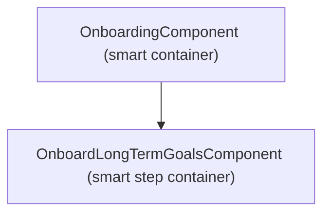

# Onboarding Step 1 (Long Term Goals) — Architecture Plan

Technical architecture for this feature, covering routing, database entities (models only), and component hierarchy. Security rules and composite indices are planned separately in `harden-plan.md`. This document is owned by `/feature-architect-plan`.

## 1. Routing

<!-- Define the routes this feature introduces. Include the route path, the component it renders, any guards, and the purpose. -->

| Route | Component | Guard | Purpose |
|---|---|---|---|
| `/onboarding` | `OnboardingComponent` | `AuthGuard` | Multi-step onboarding shell hosting Step 1 (`OnboardLongTermGoalsComponent`) when `user.onboardingState === OnboardingState.STEP_1` |

**Notes:**
<!-- Document routing decisions: why certain routes exist, guard reuse, lazy loading boundaries, 404 handling strategy, and any relationship to existing routes. -->
- Reuses the existing `/onboarding` route defined in `src/app/app.routes.ts`.
- Navigation between onboarding steps is state-driven through `user.onboardingState` rather than sub-routes, query parameters, or URL state.
- The in-app "Back" button transitions `user.onboardingState` from `STEP_1` back to `WELCOME`. Browser Back navigates to the previous browser history entry as per existing application architecture.
- The route is lazy-loaded using `loadComponent` and guarded by the existing class-based `AuthGuard` (`src/app/core/auth/auth.guard.ts`).
- Cold-start & resume contract:
  - If `user.onboardingState === OnboardingState.DONE`, navigating to `/onboarding` redirects to `/home`.
  - Authenticated users with `user.onboardingState === OnboardingState.STEP_1` resume directly at Step 1 upon landing or signing back in.

**Generation Commands:**
<!-- List every ng generate command you will use to create the above route guards. -->
- (None required — reuses existing `AuthGuard` in `src/app/core/auth/auth.guard.ts`)

## 2. Database Entities

<!-- Define the data models this feature requires. For each entity, specify its Firestore collection name and TypeScript interface. Follow existing conventions (e.g., `__id`, `_createdAt`, `_updatedAt`, `_deleted`, `__` prefix for foreign keys). -->

**LongTermGoal** (`longTermGoals` collection):
```typescript
interface LongTermGoal {
  __id: string;
  __userId: string;
  oneYear: string;
  fiveYear: string;
  longTermGoalNotes?: string;
  oneYearNotes?: string;
  fiveYearNotes?: string;
  _createdAt?: Timestamp;
  _updatedAt?: Timestamp;
  _deleted?: boolean;
}
```

**Modified Existing Entities:**
<!-- If this feature adds fields to existing entities, list them here. Otherwise, remove this section. -->
- **User:** Existing entity (`users` collection) uses `onboardingState: OnboardingState` where `OnboardingState.STEP_1 = 'step 1'` corresponds to Onboarding Step 1.

**Entity Relationships:**
<!-- Map all relationships between entities. Every hierarchy, grouping, or parent-child relationship in the UI must be represented here with explicit foreign keys. -->

| Relationship | Type | FK Field | On Entity | Notes |
|---|---|---|---|---|
| LongTermGoal → User | many:1 | `__userId` | `LongTermGoal` | Each user document is associated with their LongTermGoal containing 1-year and 5-year goal descriptions |

> [!NOTE]
> **Security Rules** and **Composite Indices** are NOT planned in this document. They are defined later in `harden-plan.md` by the `/feature-harden-plan` skill, after implementation is complete.

**Notes:**
<!-- Document entity design decisions: normalization choices, denormalized fields and why, foreign key naming, atomic write requirements, and any future migration considerations. What are the loading, error, and empty states for each entity — how does the application handle each state? -->
- `LongTermGoal` is normalized in its own collection (`longTermGoals`) rather than embedded on `User`, maintaining separation of concerns and matching existing store architecture (`LongTermGoalStore`).
- Writes on `onNext()` save the `LongTermGoal` document via `LongTermGoalStore` (or `BatchWriteService`) and advance `user.onboardingState` to `OnboardingState.STEP_2`.
- Pre-population & Loading state: If an existing `LongTermGoal` exists for `currentUser().__id` (e.g., when navigating Back from Step 2 to Step 1), `OnboardLongTermGoalsComponent` selects it from `LongTermGoalStore` and pre-fills `oneYearGoal` and `fiveYearGoal` signals.

**Generation Commands:**
<!-- List every ng generate command you will use to create the above entities. Use the --foreign-keys flag to declare foreign key fields — this automatically adds the FK fields to the model interface AND generates the required composite Firestore indexes. -->
- `ng generate @tech4good/angular-schematics:entity long-term-goal --foreign-keys=userId`

## 3. Component Hierarchy

<!-- Describe the component tree using a Mermaid diagram and tables. Clearly distinguish smart (container) components that own state and data fetching from dumb (presentational) components that receive inputs and emit outputs. -->



**Smart (Container) Components:**

| Component | Responsibility | Data/State Inputs |
|---|---|---|
| `OnboardingComponent` | Top-level onboarding shell. Observes `currentUser` and `onboardingState` to render the active step container. | `AuthStore.user` (`currentUser`) |
| `OnboardLongTermGoalsComponent` | Container for Step 1. Manages goal input signals (`oneYearGoal`, `fiveYearGoal`), queries existing `LongTermGoal` for current user to prepopulate, validates inputs (`canProceed`), handles `onBack` (`onboardingState = WELCOME`), and handles `onNext` (persists `LongTermGoal` and updates `onboardingState = STEP_2`). | `AuthStore.user`, `LongTermGoalStore` (`longTermGoals`) |

**Generation Commands:**
<!-- List every ng generate command you will use to create the above smart components. -->
- (Existing component in `src/app/first-time/onboarding/step-pages/onboard-long-term-goals/`)

**Presentational (Dumb) Components:**

*(None required for Step 1 — `OnboardLongTermGoalsComponent` template is concise (~38 lines), containing two form fields and navigation buttons; keeping it unified avoids over-decomposition and prop-drilling).*

**Generation Commands:**
<!-- List every ng generate command you will use to create the above presentational components. -->
- (None)

**Service:**

| Service | Responsibility | Used By |
|---|---|---|
| `BatchWriteService` | Executes atomic Firestore batch writes when saving `LongTermGoal` and updating `user.onboardingState` simultaneously. | `OnboardLongTermGoalsComponent` |

**Generation Commands:**
<!-- List every ng generate command you will use to create the above services. -->
- (Existing service `src/app/core/store/batch-write.service.ts`)

---

## Appendix: Architecture Stances & Open Issues
<!-- Stances & Open Issues from the architecture planning process. Owned by /feature-architect-plan.
     Log ONLY:
     - 🔵 Strong Stances: moments where the user pushed back against something the agent proposed and explained their reasoning. Must state what was rejected and why.
     - ⏳ Deferred Issues: questions, concerns, or scope decisions explicitly flagged to revisit later.
     Do NOT log decisions that have been fully incorporated into the main body.
     The full cycle-by-cycle evolution is tracked in architect-plan-evolution.md. -->

### Routing
- 🔵 **Existing Class-Based AuthGuard Retained**: User rejected refactoring `AuthGuard` into a functional guard, establishing that global routing guard changes are out of scope for Onboarding Step 1.
- 🔵 **Pure State-Driven Onboarding Navigation**: User rejected history manipulation (`pushState` / URL sub-routes / query params), maintaining that step navigation remains exclusively driven by `user.onboardingState` with in-app Back handling `STEP_1` -> `WELCOME`.

### Database Entities

### Component Hierarchy
